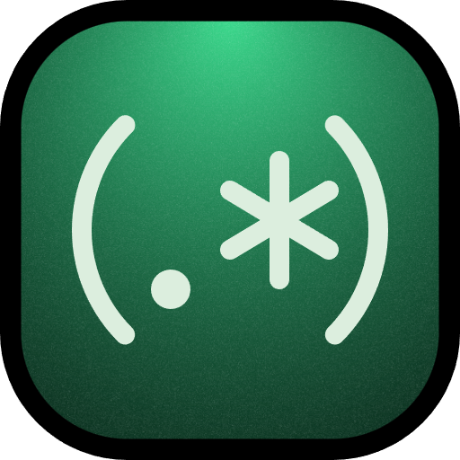

#  RegexLab

A fully client-side regex testing and explanation tool built for developers. Test regular expressions against any string, understand every token in plain English, save patterns across sessions, and export results — all without a backend, authentication, or internet connection after first load.

**Live Demo:** [regexlab-solez.vercel.app](#) — **Documentation:** [regexlab-solez.vercel.app/docs](#)

---

## Overview

RegexLab occupies the space between a basic online regex checker and a full IDE plugin. It provides instant visual feedback on every keystroke, a deterministic plain-English explainer for every regex token, a persistent pattern library stored in `localStorage`, and clean JSON and CSV export — packaged as a fast Next.js application with dark mode by default.

The regex engine runs natively in the browser via a Web Worker. There is no server processing, no user accounts, and no data ever leaves the browser.

---

## Features

**Real-time evaluation** — Pattern and test string are evaluated on every keystroke with a 50ms debounce. For inputs exceeding 50,000 characters the debounce increases to 300ms. Evaluation is offloaded to a Web Worker with a 2,000ms timeout to prevent catastrophic backtracking from freezing the UI.

**Visual match highlighting** — All matches are highlighted inline in the test string with alternating amber and teal colors so adjacent matches are visually distinct. Each highlighted span includes a hover tooltip showing the match index, character positions, and any capture group values.

**Regex explainer** — Every token in the pattern is parsed by a hand-written recursive descent parser and explained in plain English. The explainer handles anchors, quantifiers, character classes, capture groups, named groups, lookaheads, lookbehinds, alternation, and escape sequences. No external library or AI is used — the parser is pure deterministic logic.

**Pattern library** — Save, label, and reload regex patterns across browser sessions via `localStorage`. Ten built-in patterns cover the most common use cases and are pre-loaded on first launch. The library holds up to 100 saved patterns.

**Export** — Export all matches as RFC 4180-compliant CSV or structured JSON. One-click copy of all match values to the clipboard via `Ctrl+Enter`.

**Keyboard-first** — Full keyboard navigation with global shortcuts for focusing the pattern input, saving patterns, copying matches, and clearing the workspace.

**Flag support** — All six JavaScript regex flags are supported with toggleable controls: `g` (global), `i` (case-insensitive), `m` (multiline), `s` (dotAll), `u` (unicode), `d` (indices). Default on load: `gi`.

---

## Tech Stack

| Layer | Technology |
|---|---|
| Framework | Next.js 14 (App Router) |
| Language | TypeScript (strict mode) |
| Styling | Tailwind CSS v3 with class-based dark mode |
| Animations | Framer Motion v11 |
| Fonts | Geist Mono, Syne (via `next/font/google`) |
| Persistence | Browser `localStorage` — no database |
| Regex engine | Native JS `RegExp` via Web Worker |
| Testing | Vitest |
| Deployment | Vercel |

---

## Getting Started

### Prerequisites

- Node.js 18 or higher
- npm 9 or higher

### Local Development

```bash
git clone https://github.com/solez-ai/regexlab
cd regexlab
npm install
npm run dev
```

Open [http://localhost:3000](http://localhost:3000) in your browser.

### Production Build

```bash
npm run build
npm start
```

### Static Export

The application can be exported as a fully static site and hosted on any CDN or static file server without a Node.js runtime.

```bash
npm run build
```

The output in `.next` is ready for deployment on Vercel with zero configuration. For other hosts, configure `output: 'export'` in `next.config.ts` to generate a static `out/` directory.

---

## Project Structure

```
regexlab/
├── app/
│   ├── layout.tsx              Root layout, theme provider, metadata
│   ├── page.tsx                Main application page
│   ├── docs/
│   │   └── page.tsx            Documentation page at /docs
│   └── globals.css             CSS custom properties, Tailwind base
├── components/
│   ├── layout/
│   │   ├── TopBar.tsx          Fixed navigation bar
│   │   └── Sidebar.tsx         Right panel container
│   ├── regex/
│   │   ├── RegexInput.tsx      Pattern input with flag display
│   │   ├── FlagToggle.tsx      Six flag toggle buttons
│   │   └── ErrorBanner.tsx     Invalid regex error display
│   ├── testing/
│   │   ├── TestTextarea.tsx    Test string input
│   │   └── MatchHighlighter.tsx  Inline match highlighting
│   ├── results/
│   │   ├── MatchList.tsx       Scrollable match list
│   │   ├── GroupsPanel.tsx     Capture group display
│   │   └── StatsBar.tsx        Match count and timing
│   ├── sidebar/
│   │   ├── Explainer.tsx       Token-by-token explanation
│   │   ├── SavedPatterns.tsx   Pattern library with CRUD
│   │   ├── ExportPanel.tsx     JSON, CSV, and clipboard export
│   │   └── CheatSheet.tsx      Quick-reference syntax guide
│   └── ui/
│       ├── Button.tsx
│       ├── Badge.tsx
│       ├── Tooltip.tsx
│       └── Toggle.tsx
├── hooks/
│   ├── useRegex.ts             Core evaluation hook
│   ├── useLocalStorage.ts      Typed localStorage hook
│   ├── useDebounce.ts          Input debounce hook
│   ├── useTheme.ts             Dark/light mode hook
│   └── useKeyboardShortcuts.ts Global keyboard bindings
├── lib/
│   ├── explainer.ts            Recursive descent token parser
│   ├── exporter.ts             JSON and CSV formatters
│   ├── patterns.ts             Built-in seed patterns
│   └── utils.ts                Shared utility functions
├── types/
│   └── index.ts                Shared TypeScript interfaces
└── public/
    └── regex-worker.js         Web Worker for safe regex eval
```

---

## Keyboard Shortcuts

| Windows / Linux | macOS | Action |
|---|---|---|
| Ctrl + K | Cmd + K | Focus the pattern input |
| Ctrl + Enter | Cmd + Enter | Copy all matches to clipboard |
| Ctrl + S | Cmd + S | Open the save pattern form |
| Ctrl + Shift + C | Cmd + Shift + C | Clear pattern and test string |
| Escape | Escape | Close open forms and tooltips |

---

## Built-in Patterns

Ten patterns are pre-loaded on first launch and available in the saved patterns library.

| Name | Pattern | Flags |
|---|---|---|
| Email address | `\b[\w.+-]+@[\w-]+\.[\w.]+\b` | gi |
| URL | `https?:\/\/[^\s/$.?#][^\s]*` | gi |
| ISO date | `\d{4}-(?:0[1-9]\|1[0-2])-(?:0[1-9]\|[12]\d\|3[01])` | g |
| Hex color | `#(?:[0-9a-fA-F]{3}){1,2}\b` | gi |
| IPv4 address | `\b(?:\d{1,3}\.){3}\d{1,3}\b` | g |
| Phone number | `\+?[\d\s().\-]{7,20}` | g |
| HTML tag | `<\/?[a-z][a-z0-9]*(?:\s[^>]*)?>` | gi |
| Semantic version | `\bv?\d+\.\d+\.\d+(?:-[\w.]+)?\b` | gi |
| Credit card | `\b(?:\d{4}[\s-]?){3}\d{4}\b` | g |
| UUID v4 | `[0-9a-f]{8}-[0-9a-f]{4}-4[0-9a-f]{3}-[89ab][0-9a-f]{3}-[0-9a-f]{12}` | gi |

---

## Export Formats

### JSON

```json
{
  "pattern": {
    "source": "\\b[\\w.+-]+@[\\w-]+\\.[\\w.]+\\b",
    "flags": "gi"
  },
  "testString": "Contact us at hello@example.com",
  "matches": [
    {
      "value": "hello@example.com",
      "index": 14,
      "length": 17,
      "groups": {},
      "captures": []
    }
  ]
}
```

### CSV

Columns: `match_index`, `value`, `start`, `end`, `length`. Named capture groups appear as additional columns. Values with commas, double-quotes, or newlines are quoted per RFC 4180.

---

## Performance

- Sub-16ms evaluation for test strings up to 10,000 characters with well-formed patterns
- 300ms debounce for test strings exceeding 50,000 characters
- Web Worker with 2,000ms timeout prevents catastrophic backtracking from blocking the UI
- Maximum 100 matches rendered in the DOM regardless of total match count

---

## Contributing

Contributions are welcome. Please follow these steps:

1. Fork the repository
2. Create a feature branch from `main`: `git checkout -b feature/your-feature-name`
3. Make your changes
4. Run `npm run build` to verify there are no TypeScript or build errors
5. Run `npx vitest run` to ensure all tests pass
6. Open a pull request with a clear description of the change

**Code standards:**

- All new code must be TypeScript. No `any` types.
- All new components must have explicit prop interfaces.
- Tests in `lib/explainer.test.ts` and `lib/exporter.test.ts` must continue to pass.
- No external dependencies may be added without discussion in an issue first.

---

## Author

**Samin Yeasar**

- GitHub: [github.com/solez-ai](https://github.com/solez-ai)
- X: [x.com/Solez_None](https://x.com/Solez_None)
- Portfolio: [solez.vercel.app](https://solez.vercel.app)

